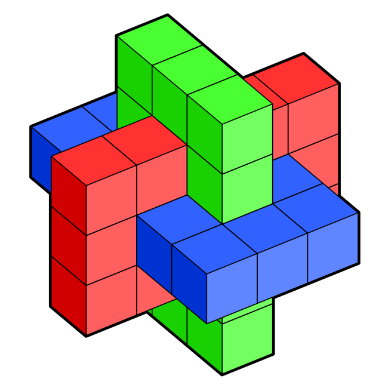
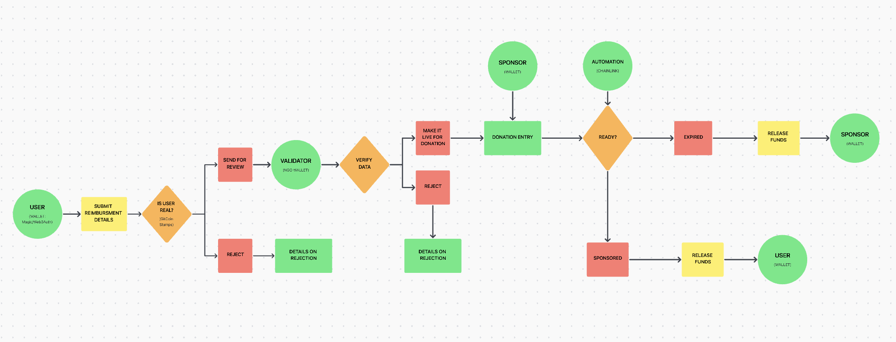
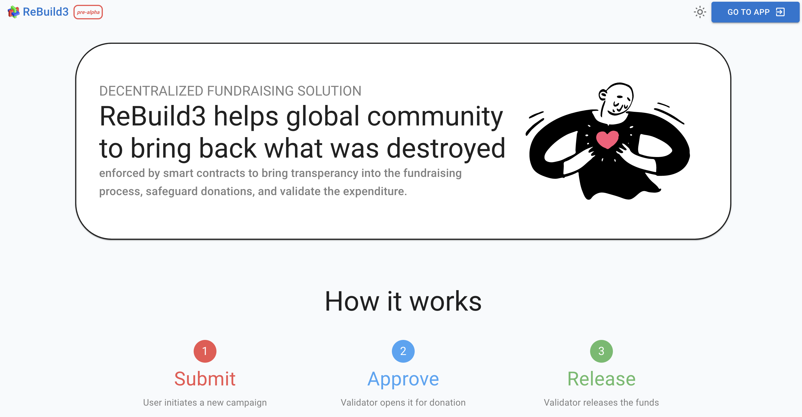
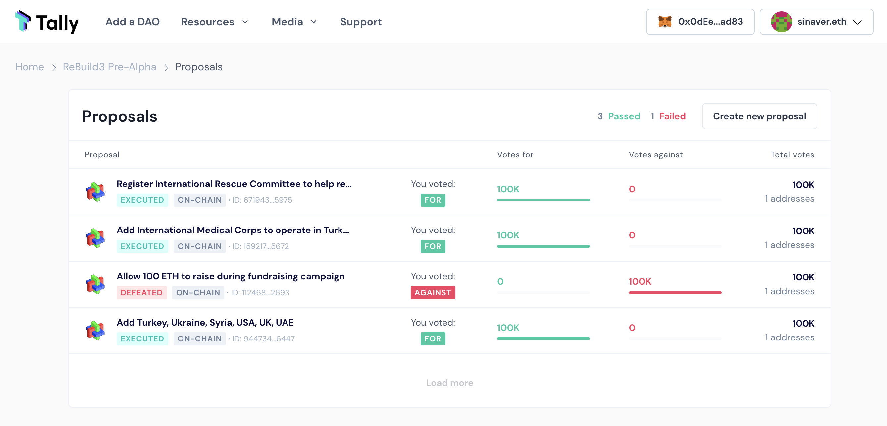
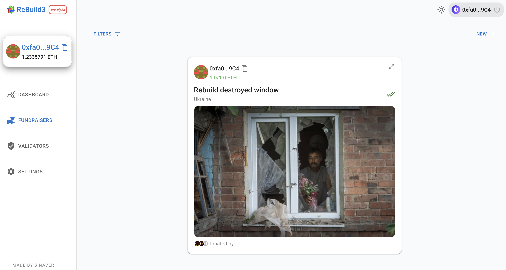
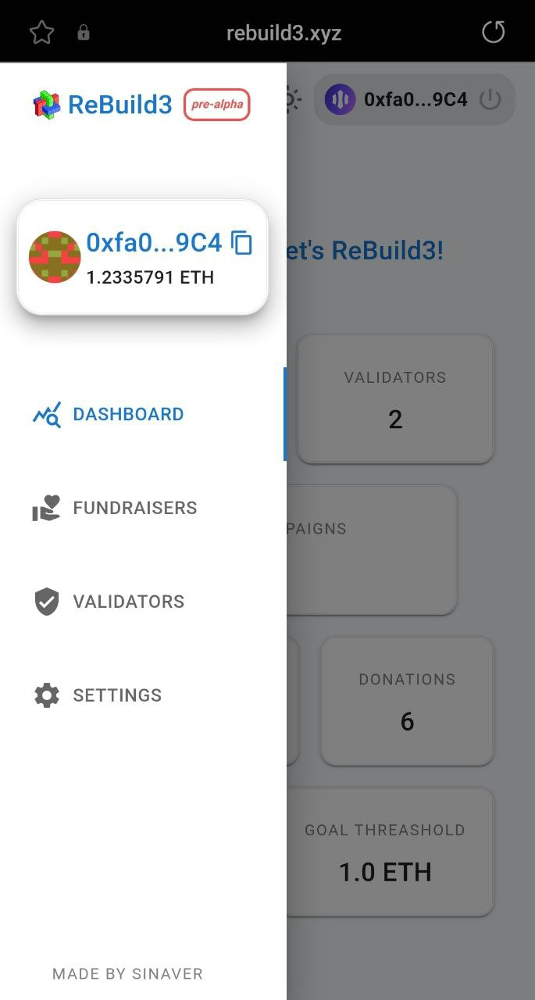
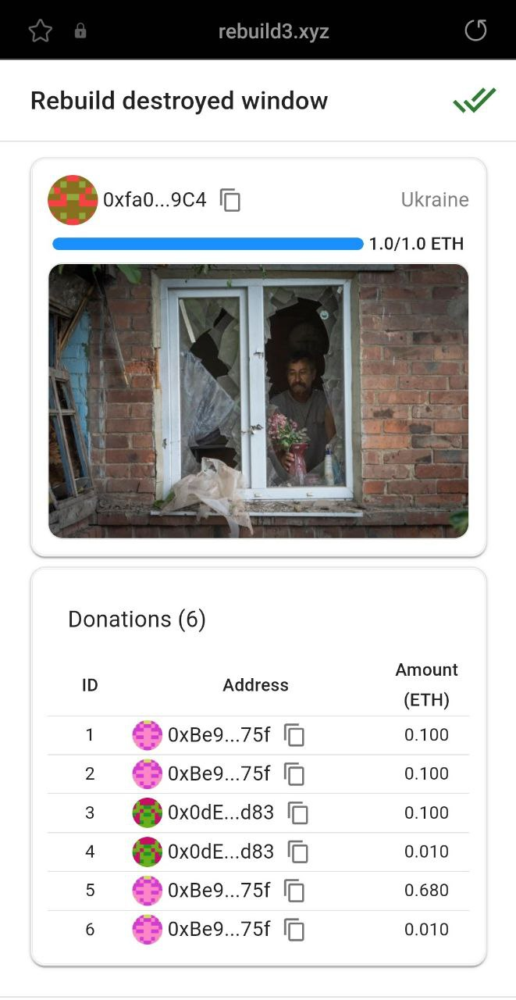

# (ReBuild3) => {[rebuild3.xyz](https://rebuild3.xyz/)}


## Description:

**Decentralized fundraising platform**, which helps global community to restore what was destroyed/damaged as a result of war, natural disaster, etc; enforced by smart-contracts to bring transparency into the fundraising process, safeguard donations, community based decision making (in future: DID, on-chain reputation, expenditure validation, campaign multi-rounds fundraising).

* * * 

## Problem statement ❌:

There are alsmost no fundraising solutions to fascilitate rebuilding post war, natural disasters, etc; in most cases those are big organizations with centralized decision making on funds distribusion.

Existing general purpose fundraising platforms lack transperancy in fundraising process, how donations are safeguarded, global community has almost no influence on decision making.

* * * 

## Solution ✅:

Using web3 smart-contract technologies, by default, we achieve accessebility, transparency and donations safeguarding in the fundraising process; decentralised autonomous organization (DAO) makes it possible for anyone to be part of decision making process.

#### Basic Product Workflow:



* * *

## Features📱:

1. Fully responsive dApp (support for most mobile/desktop browsers) fundraising platform accessible at [rebuild3.xyz](https://rebuild3.xyz/).
2. Smart-contracts decision making is fascilitated by [ReBuild3 DAO](https://www.tally.xyz/gov/rebuild3-pre-alpha) accessible via Tally platform.
3. There is a concept of active regions where fundraising is allowed.
4. Every region has its own list of organizations which fascilitate fundraising campaign validation.
5. Users can connect their wallet either throught available embeddable browser wallet (metamask), or via Magic Connect with your email (Magic Connect mode allows also to connect via Wallet Connect).
6. The platform should allow submitting rebuild campaign with specific expense criteria details, including information on what was destroyed: description, images.
7. There is a fundraising threashold, so that DAO can control over the time how much can be raised, and introduce new processes.
8. A person can donate for specific campaign.
9. Organization can approve campaign for fundraising after basic submission information check.
10. The system should not allow the organization to get money or send it to anyone else, the only thing it can do is approve an "escrow" for realeasing funds.

### User Interface:  







<p>


</p>


* * * 

## Next Steps 🚀:  

* Secure Web3 messaging(@xmtp protocol)
* Decentralized Identity (gitcoin passport integration)
* On-chain reputation
* Expenditure validation (user submits restoration results)
* Campaign multi-rounds fundraising (allow previous rounds' donors to vote to approve start of the next round)
* Tokenomics/validators fees.

* * *

## Technical details 🛠️:

In this monorepo there are 2 projects: **solidity** and **app**.
In solidity all smart-contract (EVM) related work is done, where in app - all front-end.

**app** project depends on artifacts published in **solidity**, make sure to compile smart-contracts before running/bulding front-end.

### Smart-Contracts

Hardhat is used as development framework for smart-contracts.

Firstly, go to the solidity project and install dependencies:

```
cd solidity; npm install
```

Compile project to generate contract artifacts and run tests:

```
npx hardhat compile
npx hardhat test 
```

* * *
